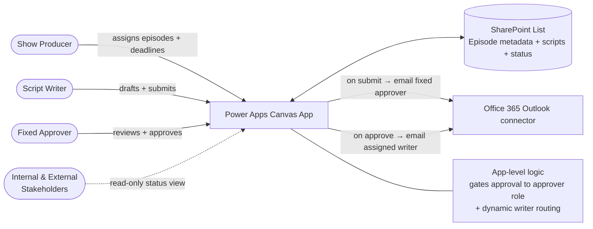

# Show Management System

> A Power Apps solution that manages the full script lifecycle for a broadcast team — assignment, multilingual drafting, review, and single-approver sign-off — replacing scattered email threads and documents with one governed workflow.


---

## 🎯 The Problem

A broadcast production team produces scripts for a high volume of episodes on a recurring schedule. Each episode requires a script that is written, reviewed, and formally approved before it can go to air. Before this app:

- Scripts moved through **email and loose documents**, making it hard to track which episode was at which stage.
- There was **no single source of truth** for episode metadata (theme, hosts, producer, telecast date, shoot date) — writers pulled this from different places.
- **Approval was informal**, with no clear record of who approved what, when, or with what remarks.
- Status — *assigned, submitted, approved* — lived in people's heads and inboxes, so producers couldn't see pipeline health at a glance.
- Scripts are **multilingual** (English and Hindi in the same document), which plain email/doc workflows handled awkwardly.

---

## 💡 The Solution

A single canvas application that centralizes the entire script pipeline. Episode metadata flows in automatically from a governed list, writers draft directly in a rich-text editor that supports multiple languages, and a designated approver holds sole authority to sign off — with every status change and remark captured.

### Key Features

- **Episode queue with live status** — a scrollable list of episodes showing schedule code, episode number, assigned writer, deadline, submission date, and color-coded *Submitted / Approved* status, so the whole pipeline is visible at once.
- **Auto-populated show context** — episode number, theme, monthly theme, hosts, producer, telecast date, day, and shoot date are pulled from a SharePoint list rather than re-entered.
- **Rich-text, multilingual script editor** — full formatting controls with a language toggle (e.g. English / Hindi) so bilingual scripts are authored in one place.
- **Producer-driven assignment** — the show producer assigns episodes to different writers and sets deadlines from within the app.
- **Single-approver workflow** — approval authority is reserved for one fixed approver, enforced through **app-level logic** that gates the approval controls and remarks to that role alone.
- **Submit & email with dynamic routing** — submission and approval trigger email **directly from Power Apps** (e.g. the Office365Outlook connector). The approver is a fixed recipient on submission, but **once approved, the notification is dynamically routed back to the specific script writer** who owns that episode.
- **Shared status visibility** — all internal and external stakeholders have a read view of script status, assignees, and deadlines, so everyone tracks the pipeline without chasing updates.

---

## 🏗️ Architecture



> All workflow logic — submission, approval gating, and email routing — is handled **within Power Apps itself**, with no Power Automate flows. The approval controls are enabled only for the designated approver, and the post-approval email recipient is resolved dynamically from the episode's assigned writer.

---

## 🧰 Tech Stack

| Layer | Technology |
|---|---|
| Frontend / UI | Power Apps (Canvas) |
| Data | SharePoint List (episode metadata, scripts, status) |
| Workflow & Email | Handled in-app via Power Apps (Office 365 Outlook connector) — no Power Automate |
| Notifications | Outlook / Microsoft 365 mail |
| Access Control | App-level logic (approval gated to fixed approver role) |

---

## 👤 My Role

Sole designer and developer. I:

- Modeled the episode/script data structure in SharePoint
- Designed and built the canvas app UI, including the status-driven episode queue
- Built the producer-driven assignment and deadline workflow
- Implemented app-level approval logic restricting sign-off to a single fixed approver
- Built the in-app email logic (Office 365 Outlook connector) for submission notifications and dynamic post-approval routing back to the assigned writer — entirely within Power Apps, no Power Automate
- Set up shared, read-only status visibility for internal and external stakeholders

---

## 📊 Results

- ⏱️ **Strictly enforced the script submission window** — deadlines that were unmanageable and routinely slipped before are now systematically tracked and enforced
- 📋 Gave producers **real-time pipeline visibility** across all in-flight episodes
- ✅ Established an **auditable approval trail** where none existed before
- 👥 Adopted by **10 users** across writers, approvers, and producers
- 🎬 Manages scripts across **21+ episodes per month**

---

## 📸 Screenshots


*Main view: episode queue with status tracking (left), show metadata and approval controls (center), and the multilingual rich-text script editor (right).*

---

## 📁 What's in This Repo

```
/src        — exported Power Apps source (unpacked via Power Platform CLI)
/docs        — architecture diagram, screenshots
/samples    — sample SharePoint list schema + dummy episode data
```


---

## 🔗 Related

- [Back to my profile](#)
